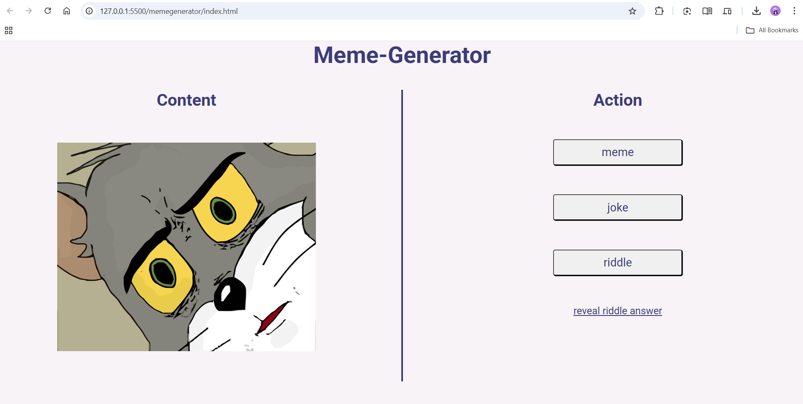
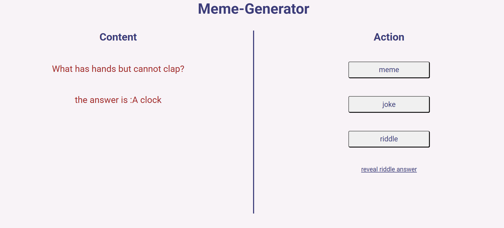

# 😂 Meme, Joke & Riddle Generator

A fun little web app where users can click a button to generate random memes, jokes, and riddles. Built using **HTML, CSS, and JavaScript**.

---

## 🧠 Features

- 🔁 Random meme image generator
- 🤣 Random joke display
- 🧩 Random riddles with reveal option
- 🎨 Clean and responsive UI
- 💡 Great project for beginners in frontend development

---

## 🚀 Tech Stack

- HTML5
- CSS3
- JavaScript (Vanilla)

---

## 🎮 Demo

https://your-username.github.io/meme-generator/  
*(Replace with your GitHub Pages link once deployed)*

---

## 📸 Screenshots

  
  


---

## 🛠️ How to Run Locally

```bash
git clone https://github.com/EternalAkhil/meme-generator.git
cd meme-generator
open index.html
